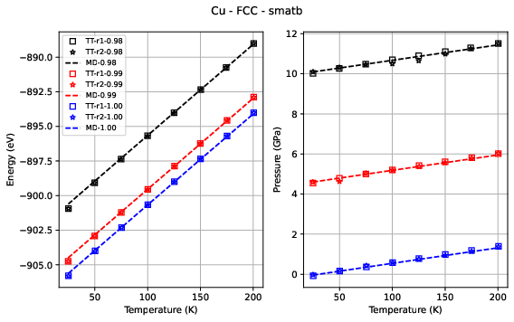
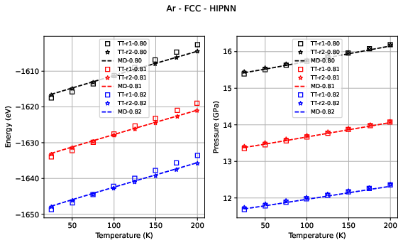
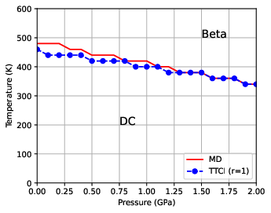

# THOR Results: Copper and Argon Simulations

## Overview

This repository contains results generated from **THOR (Tensors for High-dimensional Object Representation)** — a 400x faster physics solver developed by **Los Alamos National Laboratory**.

I successfully installed and ran THOR on my Linux machine in Algeria, reproducing the results from their published paper.

## What is THOR?

THOR is an AI framework that solves the **configurational integral** — a 100-year-old physics problem that describes how particles interact in materials.

- **Traditional methods:** Weeks on supercomputers
- **THOR:** Seconds on a regular machine
- **Speedup:** 400x faster
- **Accuracy:** Matches Molecular Dynamics exactly

## Results

### Copper (Cu)

Energy and Pressure vs Temperature for Copper (FCC structure).

### Argon (Ar)

Energy and Pressure vs Temperature for Argon (FCC structure).

### Phase Transition

Phase diagram showing material transitions.

## Files Included

| File | Description |
|------|-------------|
| `plot_cu.png` | Copper results (PNG) |
| `plot_ar.png` | Argon results (PNG) |
| `plot_phase.png` | Phase diagram (PNG) |
| `Fig_Cu_FCC_smatb_energy_pressure.pdf` | Copper results (PDF) |
| `Fig_Ar_FCC_HIPNN_energy_pressure_from_txt.pdf` | Argon results (PDF) |
| `phase_transition_plot.pdf` | Phase diagram (PDF) |

## Original Paper

- **Title:** Breaking the curse of dimensionality: Solving configurational integrals for crystalline solids by tensor networks
- **Journal:** Physical Review Materials
- **DOI:** 10.1103/xrbw-xr49

## About the Installation

I cloned the THOR repository, created a Python virtual environment, installed all dependencies (ASE, NumPy, SciPy, Matplotlib), built LAMMPS from source with Python support, and ran the TT_Configurational_Integral examples successfully.

## Next Steps

I plan to apply THOR to materials relevant to Algeria's energy sector, including:
- Solar panel materials for the Sahara region
- Battery materials for renewable energy storage

## Connect With Me

- **Name:** Ahmed Yacine Bougandora
- **Location:** Algeria
- **Email:** tth87343@gmail.com
- **GitHub:** [tahabog](https://github.com/tahabog)

## License

Results generated from open-source code (BSD-3 License).
